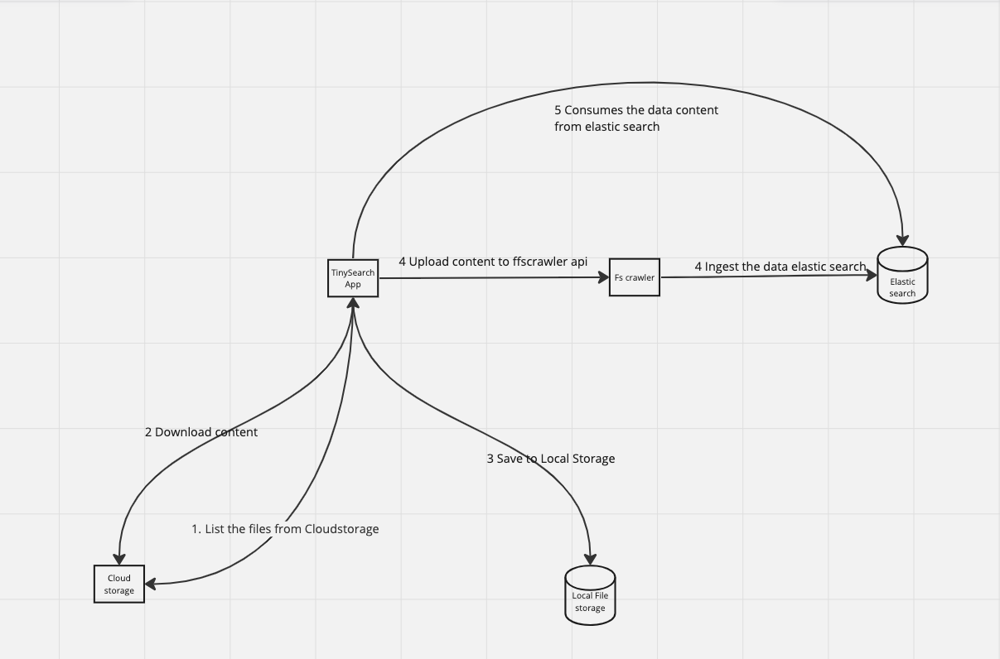
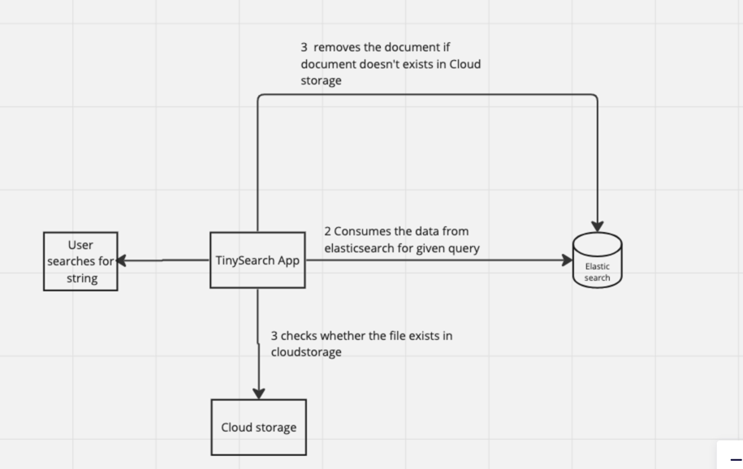

# TinySearcy 


Tiny Search a Spring boot app to search the content of the cloud storage services, At this moment only Google drive is supported

## Requirements

1. User should be able to search the content of the documents in the desired cloud storage through an api
2. User should be able to get the file path in the desired cloud storage for the intended search item
3. If the file in the cloud storage is deleted the particualr file should not be shown in the search

## Approaches
### [Fscrawler](https://fscrawler.readthedocs.io/en/latest/) and [ElasticSearch](https://www.elastic.co/guide/index.html)

1. Tiny search starts as an restful web server, on start of the application, Based on the credentinals provided by the user, smart search app integrates with respective cloud storage and downloads the files.
2. The downloaded content first saved to local path based on the configuration and then uploaded to Fscrawler over an api
3. Fscrawler internally use Apache Tike to extract the content from the file, and uplaoad the data to Elastic search
4. Below is the sample file ingested to elastic search through fscrawler
```json

{
      		"_index": "job_name",
      		"_id": "c94b8288fd34bc5c3f5b9df3c3114a60",
      		"_score": 1.0,
      		"_source": {
      			"content": "a,b,c,d\n\n",
      			"file": {
      				"extension": "csv",
      				"content_type": "text/plain; charset=ISO-8859-1",
      				"indexing_date": "2023-10-04T15:12:59.884+00:00",
      				"filename": "test4.csv"
      			},
      			"path": {
      				"virtual": "test4.csv",
      				"real": "test4.csv"
      			}
      		}
      	}
```        
6. Once the content are ingested to elastic search, Tiny search provides an api to search the data from elastic search
   7. the Query that is used for the content search is 
       ````json
      { "query": { "regexp": { "content":  { "value": "c.*", "flags": "ALL", "case_insensitive": true}}}}
    ````
7. On query results, the app verifies the cloud storage file exists in the respective cloud storage, if it is not not available the document will be deleted asynchronously  

## Highlevel flow diagram
### Data ingestion flow


### Data query flow



## Running the application locally
## Prerequisites

### [Fscrawler](https://fscrawler.readthedocs.io/en/latest/) 
### [ElasticSearch](https://www.elastic.co/guide/index.html)

### List of environment variables
| Env variable name | Env variable value type                         |
|-----------|-------------------------------------------------|
| AUTH_CODE_RECEIVER_PORT | Used by Google auth api to get access token     |
| CREDENTIAL_PATH | Used to initate the google authcode oauth flew  |
| DRIVE_FOLDER_FOR_INGESTION | Root folder from which the files are downloaded |
| FSCRAWEL_URL      | Url to communicate with fs crawler              |
| TEMP_DIR | temporary folder to save the downloaded file    |


Once these environment, Application can be started by 
```shell
./gradlew bootRun
```

### API
1. Get /api/search?query=c To search the content
2. Post  /api/refresh To refresh the data from cloud storage to elasticsearch

### References
[Design](https://miro.com/app/board/uXjVNdZO5gA=/?share_link_id=696351424297)
